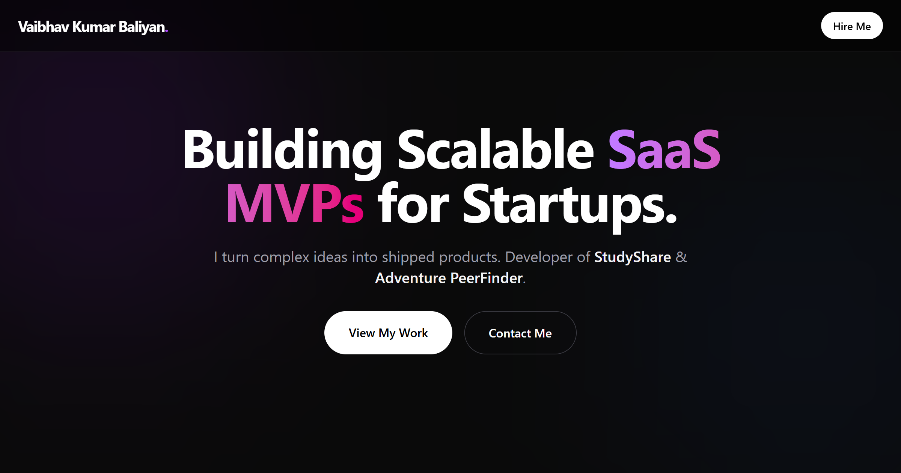

# Vaibhav Kumar Baliyan | Full Stack Portfolio

A high-performance, dark-themed portfolio website built to showcase full-stack development skills. Designed with a focus on conversion, speed, and modern UI/UX principles.



## Overview

This is not just a static site; it is a **high-conversion portfolio** designed to showcase technical expertise and turn visitors into clients. It features a "Bento Grid" project showcase, staggered animations for user engagement, and a fully functional server-side email system.

**Live Demo:** [Add Your Vercel Link Here]

## Key Features

- **Modern Dark Mode UI:** Built with **Tailwind CSS** using a custom "expensive" dark palette (Zinc/Black) for a premium feel.
- **Next.js 14 App Router:** Leveraging React Server Components (RSC) for lightning-fast initial page loads and SEO.
- **Framer Motion Animations:** Smooth, staggered entrance animations and interactive hover states to guide the user's eye.
- **Bento Grid Layout:** A responsive, Apple-style grid layout to showcase case studies (StudyShare & PeerFinder).
- **Real-Time Contact Form:** Integrated with **Resend API** to send valid business inquiries directly to email without requiring a mail client.
- **100% Responsive:** Optimized perfectly for mobile, tablet, and desktop screens.

## Tech Stack

- **Framework:** [Next.js 14](https://nextjs.org/) (TypeScript)
- **Styling:** [Tailwind CSS](https://tailwindcss.com/)
- **Animations:** [Framer Motion](https://www.framer.com/motion/)
- **Email Service:** [Resend](https://resend.com/)
- **Icons:** [Lucide React](https://lucide.dev/)
- **Font:** [Geist Sans](https://vercel.com/font)
- **Deployment:** [Vercel](https://vercel.com/)

## Project Structure

```bash
├── src/
│   ├── app/
│   │   ├── api/send/      # Server-side API route for email
│   │   ├── globals.css    # Tailwind & Theme variables
│   │   ├── layout.tsx     # Root layout & Metadata
│   │   └── page.tsx       # Main landing page composition
│   ├── components/
│   │   ├── Hero.tsx       # Animated entrance section
│   │   ├── Work.tsx       # Bento Grid project showcase
│   │   ├── ProjectModal.tsx # Detailed case study popup
│   │   ├── Services.tsx   # Infinite scroll marquee & offerings
│   │   ├── ContactForm.tsx # UI for contact form
│   │   └── Navbar.tsx     # Sticky glassmorphism navigation